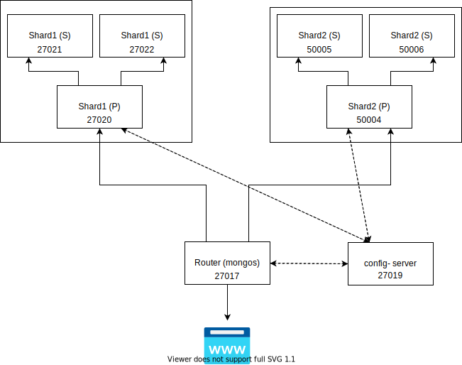

### Mongo setup
run setupMongo.sh in './sharding' folder to setup whole mongo shards architecture
```
cd sharding
sudo sh setupMongo.sh
```

to remove all the containers
```
sudo sh removeContainers.sh
```





##### notes: 
> comment line 4 and add your own ip if you are running in windows

>if running on linux, then please dont make any change